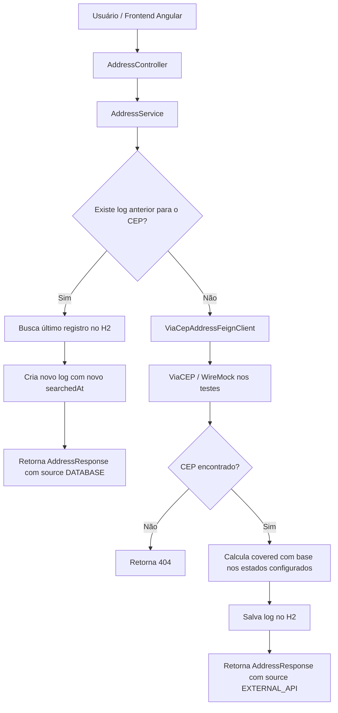

# Address Finder API

Aplicação desenvolvida para o desafio técnico da F1RST/Santander.

O objetivo da aplicação é permitir a busca de um endereço por CEP, verificar se esse endereço está dentro da área de cobertura configurada e gravar o log da consulta em banco de dados.

A aplicação foi desenvolvida com abordagem **contract-first**, usando OpenAPI como contrato principal da API.

---

## 1. Propósito da aplicação

A aplicação resolve o seguinte problema:

> Dado um CEP informado pelo usuário, buscar os dados do endereço, verificar se ele está dentro da área de cobertura da empresa e registrar a consulta em banco de dados.

A regra de cobertura é simples e configurável: a aplicação considera cobertos apenas os estados informados na propriedade `coverage.allowed-states`.

Exemplo:

```yaml
coverage:
  allowed-states: SP,RJ,MG
```

Nesse cenário:

- CEPs de SP, RJ e MG retornam `covered: true`;
- CEPs de outros estados retornam `covered: false`.

---

## 2. Tecnologias utilizadas

### Backend

- Java 21
- Spring Boot 4
- Spring Web MVC
- Spring Data JPA
- Spring Cloud OpenFeign
- H2 Database
- OpenAPI Generator
- Springdoc OpenAPI / Swagger UI
- WireMock
- JUnit 5
- Maven

### Frontend (Construido por IA)

- Angular moderno com componentes standalone
- Angular Signals
- HttpClient
- SCSS

---

## 3. Desenho da solução



---

## 4. Fluxo principal da aplicação

Endpoint principal:

```http
GET /address/zip/{zipCode}
```

Exemplo:

```bash
curl -s "http://localhost:8080/address/zip/13458870" | jq
```

Resposta esperada:

```json
{
  "zipCode": "13458870",
  "city": "Santa Bárbara D'Oeste",
  "state": "SP",
  "covered": true,
  "source": "EXTERNAL_API",
  "complement": "até 1750 - lado par",
  "neighborhood": "Residencial Mac Knight",
  "street": "Estrada do Barreirinho"
}
```

### Fluxo detalhado

1. O usuário informa um CEP no frontend ou chama diretamente a API.
2. O controller recebe a requisição através do contrato gerado pelo OpenAPI.
3. O service normaliza o CEP, removendo hífen.
4. A aplicação consulta o banco local procurando o último log daquele CEP.
5. Se encontrar:
   - usa os dados do último registro;
   - cria um novo log com `searchedAt` atualizado;
   - retorna o endereço com `source: DATABASE`.
6. Se não encontrar:
   - consulta a API externa ViaCEP via Feign Client;
   - se o CEP não existir, retorna `404`;
   - se existir, calcula a cobertura;
   - salva o log no banco;
   - retorna o endereço com `source: EXTERNAL_API`.

---

## 5. Regra de cobertura

A cobertura é configurada no `application.yaml`:

```yaml
coverage:
  allowed-states: SP,RJ,MG
```

A aplicação verifica se o campo `uf` retornado pela API externa está dentro dessa lista.

Exemplo:

- `uf = SP` → `covered = true`
- `uf = AC` → `covered = false`

Essa abordagem permite adicionar ou remover estados da área de cobertura sem alterar a lógica principal da aplicação.

---

## 6. Contrato OpenAPI

O contrato da API fica em:

```text
src/main/resources/openapi/address-api.yaml
```

A aplicação usa geração de código a partir do OpenAPI através do `openapi-generator-maven-plugin`.

O contrato define:

- endpoint `GET /address/zip/{zipCode}`;
- validação do CEP por `pattern`, `minLength` e `maxLength`;
- modelo de resposta `AddressResponse`;
- enum `AddressSource`, indicando se os dados vieram do banco local ou da API externa.

Validação de CEP no contrato:

```yaml
pattern: '^\d{5}-?\d{3}$'
minLength: 8
maxLength: 9
```

Formatos aceitos:

```text
13458870
13458-870
```

---

## 7. Persistência dos logs

Os logs das consultas são gravados na tabela:

```text
address_query_log
```

A entidade responsável é:

```text
AddressQueryLogEntity
```

Campos principais gravados:

- `searchedAt`: horário da consulta;
- `cep`: CEP consultado;
- `logradouro`: logradouro retornado;
- `complemento`: complemento retornado;
- `bairro`: bairro retornado;
- `localidade`: cidade retornada;
- `uf`: estado retornado;
- `estado`: nome do estado;
- `regiao`: região;
- `ibge`: código IBGE;
- `gia`: código GIA;
- `ddd`: DDD;
- `siafi`: código SIAFI;
- `covered`: resultado da regra de cobertura.

Cada consulta bem-sucedida gera um novo registro de log.

Quando o CEP já existe no banco, a aplicação busca o último registro daquele CEP, copia seus dados, atualiza o horário da consulta e salva um novo log.

---

## 8. Estrutura do backend

```text
src/main/java/com/f1rst/challenge/address_finder
├── client
│   ├── ViaCepAddressFeignClient.java
│   └── response
│       └── AddressLogClientResponse.java
├── controller
│   ├── AddressController.java
│   └── ControllerExceptionHandler.java
├── mapper
│   └── AddressMapper.java
├── repository
│   ├── AddressRepository.java
│   └── entity
│       └── AddressQueryLogEntity.java
├── service
│   └── AddressService.java
└── AddressFinderApplication.java
```

---

## 9. Responsabilidades das classes

### `AddressController`

Responsável por receber a requisição HTTP e devolver a resposta adequada.

Tratamentos realizados:

- sucesso: `200 OK`;
- CEP não encontrado: `404 Not Found`;
- erro de validação: `400 Bad Request`;
- erro na API externa: `502 Bad Gateway`.

### `AddressService`

Contém o fluxo principal da aplicação:

- normaliza o CEP;
- busca o último registro no banco;
- consulta a API externa quando necessário;
- calcula cobertura;
- salva o log da consulta;
- retorna o DTO de resposta.

### `ViaCepAddressFeignClient`

Cliente HTTP responsável por consultar a API externa ViaCEP.

### `AddressRepository`

Camada de acesso ao banco de dados.

Busca o último registro de um CEP usando ordenação por `searchedAt`.

### `AddressQueryLogEntity`

Representa a tabela de logs de consultas.

### `AddressMapper`

Converte `AddressQueryLogEntity` para `AddressResponse`.

Foi criado porque os nomes da entidade seguem os campos retornados pelo ViaCEP, enquanto o contrato da API expõe nomes mais amigáveis em inglês, como `zipCode`, `street`, `city` e `state`.

### `ControllerExceptionHandler`

Converte exceções de validação geradas pelo contrato OpenAPI em `400 Bad Request`.

---

## 10. Aplicação de SOLID

A aplicação utiliza conceitos básicos de SOLID principalmente através da separação de responsabilidades.

### Single Responsibility Principle

Cada classe possui uma responsabilidade principal:

- Controller: entrada e saída HTTP;
- Service: regra e fluxo de negócio;
- Repository: persistência;
- Feign Client: comunicação externa;
- Mapper: conversão entre entidade e response;
- Entity: representação da tabela de logs.

### Open/Closed Principle

A regra de cobertura é configurável por propriedade:

```yaml
coverage:
  allowed-states: SP,RJ,MG
```

Assim, é possível alterar a área de cobertura sem modificar o código da regra principal.

### Dependency Inversion Principle

A service depende de abstrações/frameworks injetados pelo Spring:

- `AddressRepository`;
- `ViaCepAddressFeignClient`;
- `ObjectMapper`.

As dependências são recebidas via construtor, facilitando testes e manutenção.

### Interface Segregation Principle

As responsabilidades ficam separadas em interfaces/classes específicas:

- contrato HTTP gerado pelo OpenAPI;
- repository do Spring Data;
- Feign Client para API externa.

### Liskov Substitution Principle

Não há hierarquia complexa no projeto. O princípio é respeitado por não haver heranças artificiais ou substituições inseguras.

---

## 11. Boas práticas utilizadas

### Contract-first

A API foi definida primeiro no arquivo OpenAPI:

```text
src/main/resources/openapi/address-api.yaml
```

A interface e os modelos da API são gerados a partir do contrato.

### Validação no contrato

O formato do CEP é validado pelo OpenAPI:

```yaml
pattern: '^\d{5}-?\d{3}$'
```

### Separação em camadas

O projeto separa claramente:

- API/Controller;
- Service;
- Client externo;
- Repository;
- Entity;
- Mapper.

### Logs de aplicação

Foram adicionados logs nos principais pontos do fluxo:

- início da busca;
- endereço encontrado no banco;
- endereço encontrado na API externa;
- endereço não encontrado;
- log salvo com sucesso.

### Testes de integração

Os testes cobrem o fluxo completo do endpoint usando:

- `MockMvc`;
- `WireMock`;
- H2 em memória;
- validações de status HTTP;
- validação da origem dos dados;
- validação da persistência dos logs.

### WireMock para API externa

A API externa é mockada nos testes, evitando dependência real do ViaCEP durante a execução dos testes automatizados.

### Normalização de CEP

A aplicação aceita CEP com ou sem hífen, mas normaliza internamente para evitar inconsistências entre busca e persistência.

Exemplo:

```text
13458-870 → 13458870
```

### Frontend separado

O frontend Angular consome a API do backend e permite demonstrar visualmente:

- consulta de CEP;
- retorno dos dados;
- cobertura;
- origem da informação.

---

## 12. Testes implementados

A classe de testes principal é:

```text
AddressControllerIntegrationTest
```

Cenários cobertos:

1. Deve buscar endereço na API externa, salvar log e retornar dados.
2. Deve retornar dados do banco quando o CEP já existir.
3. Deve criar novo log mesmo quando o dado vem do banco.
4. Deve retornar `covered: false` quando o estado não estiver configurado como atendido.
5. Deve retornar `404` quando o CEP não existir.
6. Deve retornar `400` quando o CEP for inválido.
7. Deve retornar `502` quando a API externa falhar.
8. Deve garantir que a API externa não é chamada novamente quando o CEP já está no banco.

---

## 13. Como executar o backend

Na raiz do projeto backend:

```bash
./mvnw spring-boot:run
```

Ou, se Maven estiver instalado:

```bash
mvn spring-boot:run
```

A aplicação sobe em:

```text
http://localhost:8080
```

Swagger UI:

```text
http://localhost:8080/swagger-ui.html
```

H2 Console:

```text
http://localhost:8080/h2-console
```

Configuração do H2:

```text
JDBC URL: jdbc:h2:mem:address_finder_db
User: sa
Password: vazio
```

---

## 14. Como executar o frontend

Entrar na pasta do frontend:

```bash
cd address-finder-front
```

Instalar dependências:

```bash
npm install
```

Rodar a aplicação:

```bash
ng serve
```

Acessar:

```text
http://localhost:4200
```

---

## 15. Exemplos de uso

### Buscar CEP válido coberto

```bash
curl -s "http://localhost:8080/address/zip/13458870" | jq
```

### Buscar CEP válido fora da cobertura

```bash
curl -s "http://localhost:8080/address/zip/69900001" | jq
```

### Buscar CEP inválido

```bash
curl -i "http://localhost:8080/address/zip/aaaaaaaa"
```

### Buscar CEP inexistente

```bash
curl -i "http://localhost:8080/address/zip/10101101"
```

---

## 16. Respostas HTTP

| Status | Descrição |
|---|---|
| 200 | Endereço encontrado com sucesso |
| 400 | CEP inválido |
| 404 | CEP não encontrado |
| 502 | Erro ao consultar a API externa |

---

## 17. Diferenciais implementados

Além dos requisitos básicos, o projeto possui:

- abordagem contract-first;
- Swagger UI;
- frontend Angular moderno;
- WireMock nos testes;
- H2 Console para inspeção dos logs;
- regra de cobertura configurável;
- rastreio da origem dos dados com `source: DATABASE` ou `source: EXTERNAL_API`.

---

## 18. Relação com os requisitos do desafio

| Requisito | Atendimento |
|---|---|
| Desenho de solução | Atendido nesta documentação com diagrama Mermaid |
| Buscar CEP em API externa | Atendido com Feign Client para ViaCEP |
| Usar API mockada | Atendido nos testes com WireMock |
| Gravar logs em banco | Atendido com `AddressQueryLogEntity` e H2 |
| Log conter horário da consulta | Atendido pelo campo `searchedAt` |
| Log conter dados retornados da API | Atendido pelos campos persistidos do ViaCEP |
| Usar SOLID básico | Atendido pela separação entre controller, service, repository, client e mapper |
| Repositório público no Git | Atendido pelo repositório público informado |
| Java 11 ou superior | Atendido com Java 21 |
| Banco relacional ou não relacional | Atendido com H2 relacional |

---

## 19. Resumo para apresentação

A aplicação é um verificador de cobertura por CEP.

O usuário informa um CEP pelo frontend Angular. O backend Spring Boot recebe a requisição por um endpoint definido via OpenAPI. A aplicação primeiro verifica se já existe um log anterior daquele CEP no banco local. Se existir, reutiliza esses dados, grava uma nova consulta e retorna o resultado com origem `DATABASE`. Se não existir, consulta a API externa ViaCEP, calcula a cobertura com base nos estados configurados, grava o log em banco e retorna o resultado com origem `EXTERNAL_API`.

Essa solução atende ao desafio porque realiza busca de CEP em API externa, utiliza mock com WireMock nos testes, grava os logs em banco com horário e dados retornados, aplica separação de responsabilidades e expõe uma API documentada por contrato OpenAPI.
