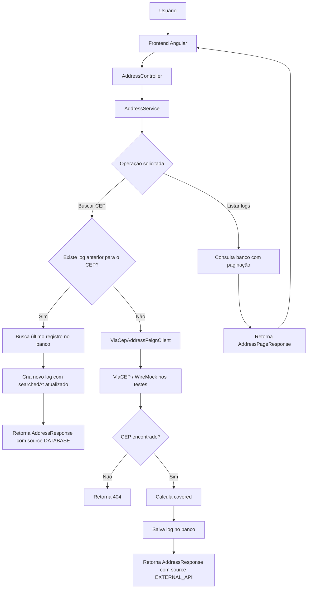

# Address Finder

Aplicação desenvolvida para o desafio técnico da F1RST/Santander.

O objetivo da aplicação é permitir que o usuário consulte um endereço por CEP, verifique se ele está dentro da área de cobertura configurada e acompanhe os logs das consultas gravadas em banco de dados.

A solução foi construída com abordagem **contract-first**, usando OpenAPI como contrato principal da API, backend em Spring Boot e frontend em Angular moderno.

---

## 1. Propósito da aplicação

A aplicação resolve o seguinte problema:

> Dado um CEP informado pelo usuário, buscar os dados do endereço, verificar se ele está dentro da área de cobertura da empresa e registrar a consulta em banco de dados.

Além da consulta individual por CEP, a aplicação também disponibiliza uma listagem paginada dos logs já gravados, permitindo visualizar o histórico de consultas realizadas.

A regra de cobertura é configurável pela propriedade `coverage.allowed-states`.

Exemplo:

```yaml
coverage:
  allowed-states: SP,RJ,MG
```

Nesse cenário:

- CEPs de SP, RJ e MG retornam `covered: true`;
- CEPs de outros estados retornam `covered: false`.

---

## 2. Funcionalidades disponíveis

### 2.1 Buscar endereço por CEP

Endpoint:

```http
GET /address/zip/{zipCode}
```

Responsabilidade:

- receber um CEP com ou sem hífen;
- normalizar o CEP para o formato sem hífen;
- procurar o último log desse CEP na base local;
- se existir, criar um novo log com os dados já conhecidos e retornar `source: DATABASE`;
- se não existir, consultar a API externa ViaCEP;
- se o CEP for encontrado na API externa, calcular a cobertura, gravar o log e retornar `source: EXTERNAL_API`;
- se o CEP não for encontrado, retornar `404`.

Exemplo:

```bash
curl -s "http://localhost:8080/address/zip/13458870" | jq
```

Resposta esperada:

```json
{
  "zipCode": "13458870",
  "city": "Santa Bárbara D'Oeste",
  "state": "SP",
  "covered": true,
  "source": "EXTERNAL_API",
  "complement": "até 1750 - lado par",
  "neighborhood": "Residencial Mac Knight",
  "street": "Estrada do Barreirinho"
}
```

### 2.2 Listar logs cadastrados com paginação

Endpoint:

```http
GET /address?page=0&size=10
```

Responsabilidade:

- listar os logs já gravados no banco;
- retornar os dados de forma paginada;
- ordenar os registros mais recentes primeiro;
- não consultar a API externa;
- permitir inspeção do histórico de consultas.

Exemplo:

```bash
curl -s "http://localhost:8080/address?page=0&size=10" | jq
```

Resposta esperada:

```json
{
  "content": [
    {
      "zipCode": "13458870",
      "street": "Estrada do Barreirinho",
      "complement": "até 1750 - lado par",
      "neighborhood": "Residencial Mac Knight",
      "city": "Santa Bárbara D'Oeste",
      "state": "SP",
      "covered": true,
      "source": "DATABASE"
    }
  ],
  "page": 0,
  "size": 10,
  "totalElements": 1,
  "totalPages": 1,
  "last": true
}
```

---

## 3. Frontend Angular (Criado inteiramente por IA)

O frontend foi criado em Angular moderno, usando componente standalone e `signals` para controle de estado da tela.

A interface possui duas abas principais:

### Buscar CEP

Permite informar um CEP e visualizar:

- CEP normalizado;
- logradouro;
- bairro;
- complemento;
- cidade;
- estado;
- se o endereço está coberto ou não;
- origem dos dados: `API externa` ou `Base local`.

### Logs cadastrados

Permite visualizar os registros já salvos no banco.

A tela de listagem apresenta:

- CEP;
- logradouro;
- cidade;
- UF;
- cobertura;
- origem;
- paginação.

Essa tela demonstra de forma visual que os logs estão sendo persistidos e podem ser consultados posteriormente.

---

## 4. Desenho da solução



---

## 5. Fluxo principal da aplicação

### Primeira consulta de um CEP

```text
Cliente informa CEP
↓
Frontend envia GET /address/zip/{zipCode}
↓
Controller recebe a requisição
↓
Service normaliza o CEP
↓
Repository procura último log no banco
↓
Não encontra
↓
Feign Client consulta ViaCEP
↓
ViaCEP retorna dados do endereço
↓
Service calcula covered
↓
Service grava log no banco com searchedAt
↓
API retorna AddressResponse com source EXTERNAL_API
↓
Frontend exibe os dados na tela
```

### Segunda consulta do mesmo CEP

```text
Cliente informa o mesmo CEP
↓
Frontend envia GET /address/zip/{zipCode}
↓
Controller recebe a requisição
↓
Service normaliza o CEP
↓
Repository encontra o último log no banco
↓
Service cria um novo registro de log com searchedAt atualizado
↓
API retorna AddressResponse com source DATABASE
↓
Frontend exibe os dados na tela
```

### Consulta paginada dos logs

```text
Usuário acessa a aba Logs cadastrados
↓
Frontend envia GET /address?page=0&size=10
↓
Controller recebe os parâmetros de paginação
↓
Service consulta o banco usando Pageable
↓
Repository retorna Page<AddressQueryLogEntity>
↓
Service converte os registros para AddressResponse
↓
API retorna AddressPageResponse
↓
Frontend renderiza a tabela paginada
```

---

## 6. Persistência dos logs

Os logs das consultas são gravados na tabela `address_query_log`.

A entidade armazena:

- horário da consulta: `searchedAt`;
- CEP;
- logradouro;
- complemento;
- unidade;
- bairro;
- cidade;
- UF;
- estado;
- região;
- códigos retornados pela API externa;
- indicador de cobertura: `covered`.

Cada consulta bem-sucedida gera um novo registro de log.

Quando o CEP já existe na base, a aplicação utiliza o último registro como fonte, cria uma nova entrada de log com `searchedAt` atualizado e retorna os dados ao consumidor.

---

## 7. Paginação

A listagem de logs usa paginação para evitar retornar todos os registros de uma só vez.

Endpoint:

```http
GET /address?page=0&size=10
```

Parâmetros:

- `page`: número da página, iniciando em `0`;
- `size`: quantidade de registros por página.

Exemplos:

```bash
curl -s "http://localhost:8080/address?page=0&size=10" | jq
curl -s "http://localhost:8080/address?page=1&size=10" | jq
curl -s "http://localhost:8080/address?page=0&size=50" | jq
```

A ordenação é feita pelos registros mais recentes primeiro, usando o campo `searchedAt`.

---

## 8. Performance e índices

Como a aplicação mantém histórico de consultas, pode haver múltiplos registros para o mesmo CEP.

Para evitar degradação conforme o volume de dados cresce, foram considerados índices nos campos usados em busca e ordenação, especialmente:

- CEP;
- horário da consulta.

Exemplo conceitual:

```sql
CREATE INDEX idx_address_query_log_cep_searched_at
ON address_query_log (zip_code, searched_at);

CREATE INDEX idx_address_query_log_searched_at
ON address_query_log (searched_at);
```

Esses índices ajudam principalmente nos fluxos:

- buscar o último log de um CEP;
- listar logs paginados ordenados por data de consulta.

---

## 9. Contract-first e Swagger

O contrato da API é definido em OpenAPI.

Endpoints principais:

```http
GET /address/zip/{zipCode}
GET /address?page=0&size=10
```

Com o backend rodando, a documentação Swagger pode ser acessada em:

```text
http://localhost:8080/swagger-ui/index.html
```

O contrato OpenAPI também pode ser acessado em:

```text
http://localhost:8080/v3/api-docs
```

A validação do CEP é definida no contrato:

```yaml
pattern: '^\d{5}-?\d{3}$'
minLength: 8
maxLength: 9
```

---

## 10. SOLID aplicado

### Single Responsibility Principle

Cada classe possui uma responsabilidade clara:

- `AddressController`: expõe os endpoints HTTP;
- `AddressService`: coordena o fluxo de busca, cobertura e persistência;
- `AddressRepository`: acessa o banco de dados;
- `ViaCepAddressFeignClient`: encapsula a comunicação com a API externa;
- `AddressMapper`: converte entidades internas para DTOs de resposta;
- frontend Angular: responsável apenas pela interação visual com o usuário.

### Open/Closed Principle

A regra de cobertura é configurável por propriedade:

```yaml
coverage:
  allowed-states: SP,RJ,MG
```

Isso permite ampliar ou reduzir a cobertura sem alterar a regra no código.

### Dependency Inversion Principle

A service depende de componentes injetados pelo Spring, como repository, client e object mapper, em vez de instanciar dependências manualmente.

---

## 11. Boas práticas utilizadas

- API contract-first com OpenAPI;
- validação de CEP definida no contrato;
- separação entre controller, service, repository, client e mapper;
- uso de Feign Client para integração externa;
- uso de WireMock nos testes;
- persistência com Spring Data JPA;
- paginação usando `Pageable`;
- normalização do CEP antes da busca;
- histórico de consultas em banco;
- logs de aplicação com SLF4J;
- resposta contendo a origem dos dados (`DATABASE` ou `EXTERNAL_API`);
- frontend Angular moderno com standalone components e signals;
- interface com abas para busca e listagem;
- tratamento visual para loading, erro, cobertura e origem;
- uso de índices para melhorar busca e ordenação dos logs.

---

## 12. Como executar

### Backend

```bash
./mvnw spring-boot:run
```

Ou, caso esteja usando Maven instalado localmente:

```bash
mvn spring-boot:run
```

### Frontend

```bash
cd address-finder-front
npm install
ng serve
```

Acessar:

```text
http://localhost:4200
```

---

## 13. Exemplos de uso

### Buscar CEP coberto

```bash
curl -s "http://localhost:8080/address/zip/13458870" | jq
```

### Buscar CEP fora da cobertura

```bash
curl -s "http://localhost:8080/address/zip/69900001" | jq
```

### Listar logs paginados

```bash
curl -s "http://localhost:8080/address?page=0&size=10" | jq
```

### Próxima página

```bash
curl -s "http://localhost:8080/address?page=1&size=10" | jq
```

---

## 14. Testes

Os testes de integração validam os principais fluxos da aplicação:

- busca de CEP existente na API externa;
- gravação do log no banco;
- segunda busca do mesmo CEP usando base local;
- criação de novo log para consultas repetidas;
- CEP fora da cobertura;
- CEP inexistente retornando `404`;
- CEP inválido retornando `400`;
- falha na API externa retornando `502`;
- listagem paginada dos logs;
- paginação com diferentes tamanhos de página.

A API externa é mockada com WireMock nos testes.

---

## 15. Relação com os requisitos do desafio

| Requisito | Atendido? | Como foi atendido |
|---|---:|---|
| Desenho de solução | Sim | Diagrama Mermaid nesta documentação |
| Buscar CEP em API externa | Sim | Integração com ViaCEP via Feign Client |
| API mockada | Sim | WireMock nos testes |
| Logs gravados em banco | Sim | Entidade `AddressQueryLogEntity` |
| Horário da consulta | Sim | Campo `searchedAt` |
| Dados retornados da API | Sim | Campos persistidos na entidade de log |
| Conceitos básicos de SOLID | Sim | Separação de responsabilidades e dependências injetadas |
| Repositório público no Git | Sim | Projeto publicado no GitHub |
| Java 11 ou superior | Sim | Java 21 |
| Banco relacional ou não relacional | Sim | H2 com Spring Data JPA |

---

## 16. Resumo para apresentação

A aplicação implementa uma solução simples e demonstrável para verificação de cobertura por CEP.

O fluxo principal mostra:

1. entrada do CEP pelo frontend;
2. busca na base local;
3. fallback para API externa quando necessário;
4. cálculo de cobertura configurável por UF;
5. gravação de log da consulta;
6. retorno dos dados ao usuário;
7. listagem paginada dos logs gravados.

Esse desenho atende aos requisitos obrigatórios do desafio e adiciona uma interface visual para facilitar a demonstração da solução.
